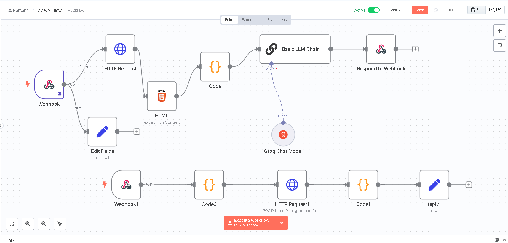

# MindMonitor – Mental Health Tracker

This is a [Next.js](https://nextjs.org) project bootstrapped with [`create-next-app`](https://nextjs.org/docs/app/api-reference/cli/create-next-app).

## Project Overview

**MindMonitor** is a modern mental health tracker that helps you log your mood, activities, and wellness metrics. It provides analytics, streaks, and AI-powered journaling to support your emotional well-being.

### Key Technologies

- **Next.js** for frontend and app routing
- **Supabase** for authentication and real-time database (showcase-ready)
- **MongoDB** for scalable data storage (showcase-ready)
- **n8n** for AI automation and journaling via webhook
- **Tailwind CSS** for styling and responsive design

## Getting Started

First, install dependencies:

```bash
npm install
# or
yarn install
# or
pnpm install
# or
bun install
```

Then, run the development server:

```bash
npm run dev
# or
yarn dev
# or
pnpm dev
# or
bun dev
```

Open [http://localhost:3000](http://localhost:3000) with your browser to see the result.

You can start editing the main page by modifying `src/app/page.tsx`. The page auto-updates as you edit the file.

## Project Structure

- `src/app/` – Next.js app directory (pages, layout, global styles)
- `src/components/` – React components (including `MentalHealthTracker`)
- `src/lib/` – Integration files for Supabase and MongoDB (showcase only)
- `public/` – Static assets
- `src/app/globals.css` – Global styles (Tailwind + custom CSS)

## Integrations

- **Supabase**: Ready-to-use client setup for authentication and real-time database (see `src/lib/supabaseClient.ts`).
- **MongoDB**: Showcase client setup for scalable data storage (see `src/lib/mongo/mongoClient.ts`).
- **n8n AI Automation**: AI-powered journaling and automation via webhook integration.

 


## 🚀 Deployment

You can deploy this Next.js app on the following platforms:

### 🔹 [Vercel](https://vercel.com/new?utm_medium=default-template&filter=next.js&utm_source=create-next-app&utm_campaign=create-next-app-readme)
Seamless integration with Next.js and supports ISR, SSR, and static exports.

🔗 **Live Demo**: [nexium.vercel.app](https://nexium-ubaid-ahmed-grand-project-gpq51a8zp.vercel.app/)  


---

### 🔹 [Netlify](https://www.netlify.com/)
Fully supports Next.js SSR and static export via `next export`.

🔗 **Live Demo**: [mindmonitor.netlify.app](https://mindmonitor.netlify.app/)  


📘 See [Netlify Next.js docs](https://docs.netlify.com/frameworks/nextjs/overview/) for setup instructions.

---

📚 Also check out the [official Next.js deployment guide](https://nextjs.org/docs/app/building-your-application/deploying) for more options.

## Environment Variables

Create a `.env.local` file for any environment-specific variables (see `.gitignore` for details).

## Contributing

Pull requests are welcome! For major
